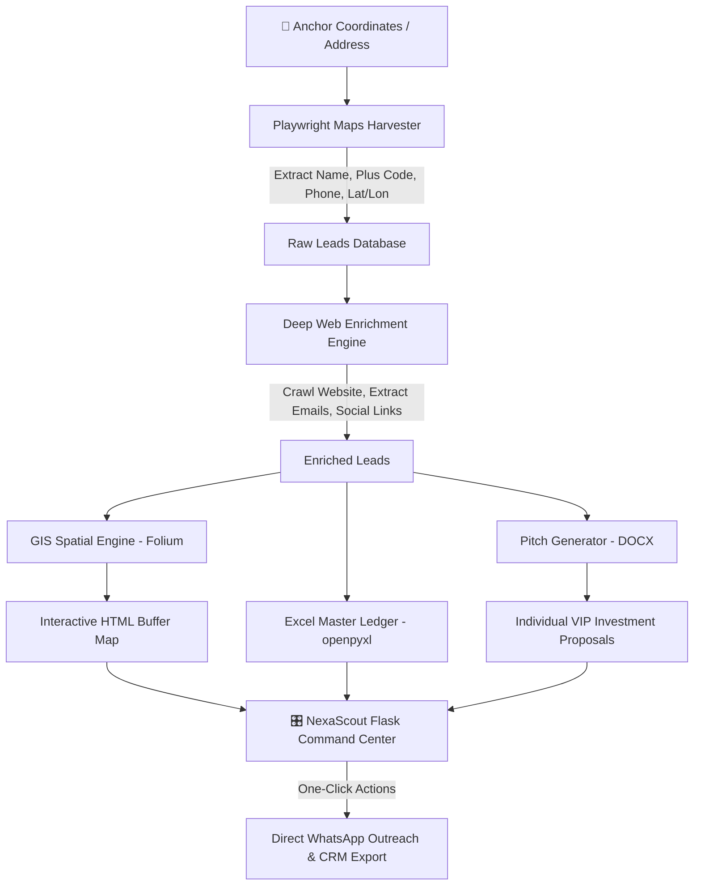

# 🦅 NexaScout™ — Autonomous B2B Lead Harvester & GIS Intelligence Suite

[](https://www.python.org/)
[](https://playwright.dev/)
[](https://flask.palletsprojects.com/)
[](https://opensource.org/licenses/MIT)
[](https://github.com/nexadigitalofficial)

> **NexaScout™** is an end-to-end, enterprise-grade PropTech and B2B Lead Generation platform. It combines headless browser automation, multi-page deep web enrichment, concentric GIS spatial intelligence, and automated institutional pitch proposal generation into a unified Flask web command center.

---

## 🌟 Executive Overview

Traditional real estate and B2B corporate marketing rely on manual directory searches and generic cold outreach. **NexaScout™** automates the entire discovery-to-pitch pipeline:

1. **Targeted Spatial Discovery:** Searches any coordinate or address with customizable radius boundaries.
2. **High-Value Sector Filtering:** Identifies institutional decision-makers (Healthcare, Private Education, Defense & Tech HQ, Prestigious Law, Consulates).
3. **Deep Web Contact Enrichment:** Crawls official websites to extract corporate emails, direct phone numbers, executive titles, and social handles (LinkedIn, Instagram).
4. **GIS Buffer Analysis:** Calculates geodesic distances and plots concentric spatial impact zones (1 km, 3 km, 5 km, 10 km) on interactive satellite maps.
5. **Hyper-Personalized Outreach:** Synthesizes custom Word (`.docx`) pitch proposals and direct WhatsApp click-to-chat links tailored to each prospect's business model.

---

## 🏛️ System Architecture



---

## ⚡ Core Modules & Capabilities

### 1. 🔍 Playwright Google Maps Harvester (`google_maps_lead_harvester.py`)
- Emulates genuine human browsing behavior with headless Chromium.
- Coordinates-anchored queries (`@lat,lon,zoom`) or custom regional queries.
- Bypasses endless dynamic scrolling limits with intelligent DOM mutation observers.
- Extracts institution name, category, rating, review count, address, Plus Code, website, phone, and coordinates.

### 2. 🌐 Deep Contact Enrichment (`modules/enrichment.py`)
- Automatically crawls the candidate's homepage and secondary pages (`/iletisim`, `/contact`, `/hakkimizda`, `/about`).
- Regex-based institutional email extraction with automatic anti-junk filtering (`@sentry`, `.png`, `.jpg` exclusions).
- Social footprint extraction: LinkedIn company pages, Instagram handles, Facebook, YouTube.
- Phone normalization for international WhatsApp format (`905xxxxxxxxx`).

### 3. 🗺️ Concentric GIS Spatial Engine (`modules/map_generator.py`)
- Renders interactive maps powered by **Folium**, **OpenStreetMap**, and **Google Hybrid Satellite** layers.
- Concentric buffer zones:
  - 🟢 **1.0 km:** Yürüme Mesafesi (Immediate Zone)
  - 🔵 **3.0 km:** Doğrudan Ticari Havza (Direct Commercial Basin)
  - 🟣 **5.0 km:** Genişleme ve VIP Hizmet Alanı (Metropolitan Reach)
  - 🟠 **10.0 km:** Bölgesel Karargâh Çapı (Regional Radius)
- Sector-specific color-coded pins (Red: Healthcare, Green: Education, Dark Blue: Defense/Tech, Dark Red: Law).
- Dynamic popups with direct phone call, WhatsApp launch, and website links.

### 4. 📄 Automated Pitch Deck & Proposal Generator (`modules/pitch_generator.py`)
- Programmatically generates bespoke corporate investment proposals in Word (`.docx`) format.
- Pre-configured executive typography (Navy Blue `#0A2540`, Gold accents `#D4AF37`, clean Calibri).
- Dynamically injects Highest-and-Best-Use (HBU) models, zoning advantages, spatial distance metrics, and commercial legal monopoly privileges.

### 5. 🎛️ Live Command Center Dashboard (`app.py` & `templates/dashboard.html`)
- Built with **Flask**, **Bootstrap 5**, **DataTables**, and **Chart.js**.
- Real-time KPI summary cards: Total Leads, Direct Phones, Verified Emails, Average Distance.
- Search, filter, and sort across all sectors, distances, and priorities.
- One-click trigger for live scraping, GIS map regeneration, and batch proposal generation.
- Responsive mobile & desktop interface at `http://localhost:5000`.

---

## 📂 Project Directory Structure

```text
nexascout/
├── app.py                         # Flask Web Command Center & API
├── google_maps_lead_harvester.py   # Core Playwright Scraping Engine
├── config.json                    # Property anchor, categories & keyword configuration
├── requirements.txt               # Python package dependencies
├── LICENSE                        # MIT Open Source License
├── README.md                      # Comprehensive project documentation
├── PANEL_BASLAT.bat               # 1-Click launcher for Web Dashboard
├── VERI_TOPLAMA_BASLAT.bat        # 1-Click launcher for CLI Harvester
├── modules/
│   ├── __init__.py                # Package exports
│   ├── enrichment.py              # Web crawler & contact enrichment
│   ├── map_generator.py           # Folium GIS interactive map generator
│   └── pitch_generator.py         # python-docx investment proposal generator
├── templates/
│   └── dashboard.html             # Web dashboard UI with DataTables & Chart.js
└── data/                          # Sample outputs and exports
    ├── GOOGLE_HARITA_TOPLANAN_KURUMLAR.xlsx
    └── INCEK_TICARI_HEDEF_HARITASI.html
```

---

## 🚀 Quick Start Guide

### Prerequisites
- Python 3.10 or higher
- Git

### 1. Clone Repository
```bash
git clone https://github.com/nexadigitalofficial/nexascout.git
cd nexascout
```

### 2. Install Dependencies
```bash
pip install -r requirements.txt
playwright install chromium
```

### 3. Launch Web Command Center
Double-click `PANEL_BASLAT.bat` or run:
```bash
python app.py
```
Open your browser at: **`http://localhost:5000`**

### 4. Or Run CLI Harvester Directly
Double-click `VERI_TOPLAMA_BASLAT.bat` or run:
```bash
python google_maps_lead_harvester.py --limit 10
```

---

## ⚙️ Customization (`config.json`)

NexaScout can be tailored to **any commercial real estate asset, city, or coordinate in the world** simply by editing `config.json`:

```json
{
  "anchor_property": {
    "title": "Your Commercial Property Name",
    "address": "Street, District, City",
    "latitude": 41.0082,
    "longitude": 28.9784
  },
  "default_radius_km": 10,
  "category_presets": {
    "saglik": {
      "name": "Sağlık & Medikal",
      "hbu_model": "Butik Poliklinik / Cerrahi Tıp Merkezi",
      "keywords": ["tıp merkezi", "diş polikliniği", "estetik kliniği"]
    },
    "egitim": {
      "name": "Özel Eğitim & Kolejler",
      "hbu_model": "Müstakil Butik Kolej / VIP Anaokulu",
      "keywords": ["özel kolej", "anaokulu", "eğitim kurumları"]
    }
  }
}
```

---

## 📊 Output Formats

| Asset | Type | Description |
|---|---|---|
| **Master Ledger** | `.xlsx` | Fully styled Excel file with frozen headers, formatted phones, emails, and ratings. |
| **GIS Map** | `.html` | Standalone interactive map with satellite/street view toggle and clickable pins. |
| **Pitch Proposals** | `.docx` | Individual executive proposals with branded cover tables and commercial briefs. |
| **REST API** | `JSON` | `/api/leads` and `/api/stats` endpoints for CRM and third-party integrations. |

---

## 🛡️ License & Trademark Notice

- **Software License:** Released under the [MIT License](LICENSE).
- **Trademark Notice:** **NexaScout™** is a trademark of **Nexa Digital** (`nexadigitalofficial`). All rights reserved.

---

<p align="center">
  Developed with ❤️ by <a href="https://github.com/nexadigitalofficial"><strong>Nexa Digital</strong></a>
</p>
